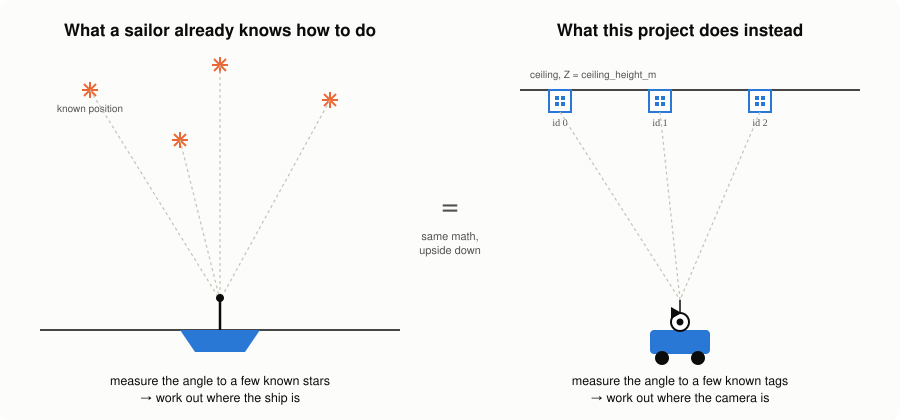
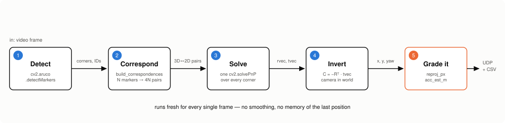
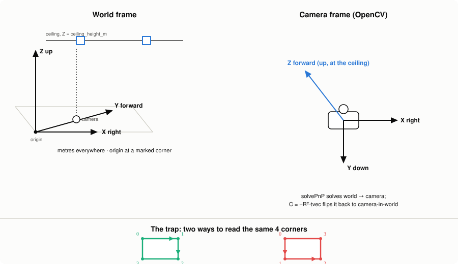
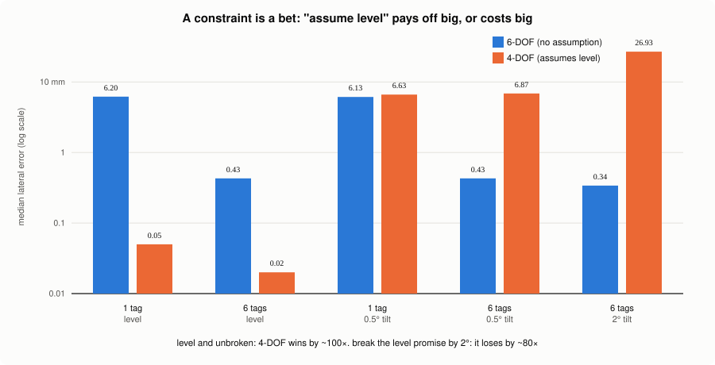

# In-house localization — a ceiling that tells you where you are

A camera pointed straight up reads a grid of printed codes taped to the ceiling, and
works out exactly where it is standing on the floor below. No satellites, no WiFi
triangulation, no beacons to install and maintain — just a camera, some cheap paper
tags, and geometry.

This repo is a **write-up**, not the codebase. It explains what was built and why,
with real (short) snippets and diagrams — the full project, tests, calibration tools
and evaluation scripts live elsewhere. The point here is to make the idea land.

We're going to explain it the way Richard Feynman said you should learn anything:
**pick the concept, explain it in plain words, find the part where the explanation
breaks down, and go fix that part until it doesn't.** So that's the shape of this
document.

---

## 1. Say it in one sentence

> A camera looks at "stars" of known position on the ceiling, and does the same
> triangulation trick a ship's navigator does with real stars — just pointed the
> other way, over metres instead of light-years.

That's the whole idea. Everything below is just making that sentence survive contact
with reality.

---

## 2. The analogy

Sailors have been doing this for centuries with a sextant. You know exactly where a
handful of stars are in the sky (astronomers already worked that out). You measure
the angle from your ship to a few of them. From those angles, you can work backward
to exactly one point on Earth's surface that would produce them. That point is you.

Swap "stars" for **printed ArUco codes** stuck to a ceiling, and "sky" for
**a ceiling whose codes were measured once with a tape measure**, and you have this
project. The camera doesn't know where it is. The codes do — their positions are
written down in a config file. The camera measures the codes' angles and shapes in
its own image, and a solver (`cv2.solvePnP`) runs the sextant math in reverse.

<p align="center">
  
</p>

The one thing worth sitting with: **the intelligence is in the map, not the camera.**
A camera alone, looking at an unlabeled ceiling, cannot tell you where it is — there's
nothing to measure against. The moment you know where three or four of those codes
*actually are* in the room, the geometry becomes solvable. That's the whole trick,
and it's why `config/markers.json` — a plain list of `{id: [x, y]}` — is arguably the
most important file in the project, not `starnav.py`.

---

## 3. How it actually works, step by step

Explaining "it does PnP" to someone who doesn't already know what PnP is isn't an
explanation — that's the Feynman trap, reusing jargon as if it were understanding.
So here's the pipeline with no term left undefined, and the real code for each step.

<p align="center">
  
</p>

### Step 1 — Read the ceiling

Standard marker detection. OpenCV finds every square code in the frame and decodes
its ID, the same way a QR scanner would, and returns the pixel coordinates of each
code's four corners.

```python
corners, ids, _rejected = detector.detectMarkers(gray)
known, unknown = split_known_unknown(corners, ids, known_ids)
```

Codes the camera has never been told about (`unknown`) are drawn but ignored —
detecting a marker doesn't mean it's on the map.

### Step 2 — Turn "what I see" into a puzzle a solver understands

This is the part that's easy to hand-wave. Each code you can see is a 15 cm (or so)
square sitting at a known spot on the ceiling. So its four corners have known 3D
positions in the room — you can compute them from the code's centre. Those same four
corners also showed up somewhere specific in the camera's 2D image. Pairing those up,
corner by corner, gives the solver its puzzle: "here are N points in 3D, here's where
they landed in 2D — figure out where the camera must have been standing to see it
that way."

```python
def build_correspondences(detections, marker_map, offsets):
    """N markers give 4N pairs, all fed to one solvePnP — not solved
    separately and averaged, because averaging throws away the one thing
    that makes multiple markers useful: their positions *relative to each
    other* constrain the camera's rotation far more tightly than any
    single tag's four corners can."""
    ...
    for marker_id, corners in detections:
        centre_x, centre_y = marker_map["markers"][marker_id]
        for (dx, dy), image_corner in zip(offsets, corners.reshape(4, 2)):
            object_points.append((centre_x + dx, centre_y + dy, height))
            image_points.append(image_corner)
```

Six visible markers means 24 point pairs feeding one solve, not six separate guesses
averaged together afterward.

### Step 3 — Solve it

One call. This is the actual "sextant math" — given a bundle of known-3D/seen-2D
point pairs and the camera's own optical properties (from a one-time calibration), it
finds the single camera position and orientation that explains all of them at once.

```python
ok, rvec, tvec = cv2.solvePnP(
    object_points, image_points, camera_matrix, dist_coeffs,
    flags=cv2.SOLVEPNP_ITERATIVE,
)
```

### Step 4 — Flip the answer the right way round

Here's the part that trips almost everyone up the first time, so it gets its own
line: `solvePnP` doesn't hand you the camera's position. It hands you the transform
that would move the *world* into the *camera's* frame — the opposite direction from
what you want. You have to invert it.

```python
R, _ = cv2.Rodrigues(rvec)          # rotation, as a 3x3 matrix
camera_in_world = (-R.T @ tvec).ravel()   # now flip it around
x, y = camera_in_world[0], camera_in_world[1]
```

If you skip this step, the position drifts and rotates in ways that look like a bug
in the marker detection. It isn't — it's just still facing the wrong way.

### Step 5 — Grade your own homework

Every position comes with a confession attached: how much do I actually trust this?
That's `reproj_px` — take the position you just computed, project the known 3D
corners back through it, and see how far off they land from where the camera
actually saw them. A camera that's lying to itself still produces *a* number; this is
what catches it.

```python
def accuracy_estimate(error_px, n_markers, range_m, camera_matrix):
    """pixel error -> a rough position uncertainty in metres, not asserted."""
    focal_px = (camera_matrix[0, 0] + camera_matrix[1, 1]) / 2.0
    ground_sampling_distance = range_m / focal_px   # metres per pixel, up there
    return ground_sampling_distance * error_px / sqrt(max(1, n_markers))
```

That single line is doing something worth spelling out in plain English: *"how many
real-world metres does one pixel of image error correspond to, at this distance,
divided down because more markers means more independent checks agreeing with each
other."* No smoothing, no fudge factor — a formula built from the actual optics.

---

## 4. Where the explanation breaks: the mirror trap

This is the Feynman step that matters — the point where saying it simply forces you
to notice you don't actually understand it yet.

"Pair up the 3D corners with the 2D corners" in Step 2 sounds mechanical. It isn't.
A square code has 4 corners, and OpenCV always reports them in the same rotational
order *as printed on the tag*. But this camera is looking at the ceiling **from
below**. Flip which side of a flat shape you're looking at, and clockwise becomes
counter-clockwise. Get the winding wrong, and you're not pairing corner 1 with corner
1 — you're pairing it with corner 3, on the diagonal. The solver doesn't crash. It
quietly returns a confidently wrong position.

<p align="center">
  
</p>

```python
def corner_offsets(half, rotation=0, mirror=False):
    """mirror is the handedness trap. It's fixed by geometry, not choice —
    which winding looks clockwise in the image depends on which side of
    the marker plane the camera is sitting on. Get it wrong and the solve
    doesn't fail quietly: it fails with a huge reprojection error."""
    base = [(-half, -half), (+half, -half), (+half, +half), (-half, +half)]
    if mirror:
        base = [(-x, y) for x, y in base]
    ...
```

The fix isn't a clever bit of trigonometry — it's refusing to reason it out on paper.
The repo's real evaluation tooling tries all 8 possible corner conventions against a
photographed grid and keeps whichever one the residual says is right, because the
correct one lands roughly **10–100× lower error** than any of the wrong ones. You
don't out-think a handedness bug; you measure your way out of it.

---

## 5. Does it actually work? Measure it, don't assume it

The project's pose solver can run in two modes, and the honest way to compare them is
to make one assumption and see what it costs when that assumption is true versus
when it's broken:

- **6-DOF** — no assumptions about how the camera is mounted. Slower to converge,
  never surprised.
- **4-DOF** — assumes the camera is mounted dead level, facing straight up. If that's
  true, the problem collapses from "find a rotation and a position" to "find a scale,
  a spin, and a shift" — much better conditioned, especially with only one marker
  visible.

<p align="center">
  
</p>

Read that chart as one sentence: **a constraint is a bet.** Tell the solver "I
promise this camera is level," and if you kept that promise, you get a dramatically
better answer for free. Break the promise by a couple of degrees, and the 4-DOF
solver doesn't fail loudly — it fails *confidently*, in the wrong direction, while the
6-DOF solver barely notices because it never took your word for it.

This is also why `reproj_px` earns its keep twice over: in 4-DOF mode, a tilted
marker images as a trapezoid that no "assume it's a flat-on square" model can fit
cleanly, so that residual quietly turns into a built-in level-mount detector.

---

## 6. Is this a toy? Being honest about the demo

The target is a Raspberry Pi under a 12-metre industrial ceiling, ±5 cm accuracy.
None of that hardware exists on a laptop. So the actual dev rig is a monitor standing
in for the ceiling, at a fraction of the real distance, with the printed codes sized
down to match — same *angular* geometry, same code path, just closer.

```
tag size / distance ratio, kept constant:
  real hall:  0.72 m tag  /  12 m ceiling   = 0.060
  demo rig:  44.8 mm tag  / 0.75 m monitor  = 0.060
```

Same ratio means the camera sees the same *shape* of problem either way — it's the
same optimisation, at model-railway scale. Every place the code takes a shortcut
because of that scaling is marked directly in the source as `# SCALED-DEMO:`, with a
note on what changes when it moves to a real ceiling. Nothing about the pose math
itself is allowed to know it's a demo.

What the scaling **can't** paper over: at 12 metres, a camera that's tilted by just
one degree reports a position roughly **21 cm off** — bigger than the whole ±5 cm
budget, from a tilt too small to notice by eye. Pixel resolution isn't the
bottleneck at that height. A level mount is.

---

## 7. Say it back in one sentence

If the two paragraphs above didn't survive, the one-liner from the top is the test:
**a camera reads known "stars" glued to a ceiling and triangulates its own position
from them — the same idea a sailor uses with real ones, run in reverse, indoors.**
If that sentence makes sense on its own, the explanation did its job.

---

## What's actually built

- Marker detection, with known/unknown split
- Fused multi-marker `solvePnP`, single-marker fallback
- 6-DOF and 4-DOF (level-assuming) pose, selectable per rig
- Per-frame quality: reprojection error, tilt angle, accuracy estimate
- Handedness resolved and measured against a real displacement test
- Camera intrinsic calibration from photos, with an RMS-isn't-enough warning built in
- CSV logging, UDP JSON output, a plain 2D top-down map window

No smoothing anywhere, on purpose — raw per-frame output, so the actual jitter stays
visible and measurable before anything gets filtered on top of it.
